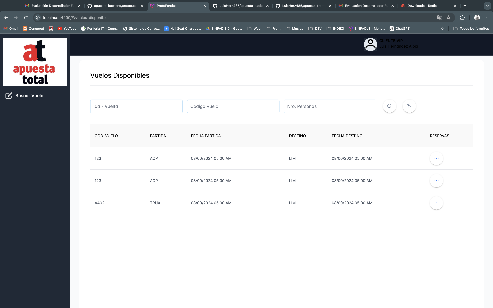
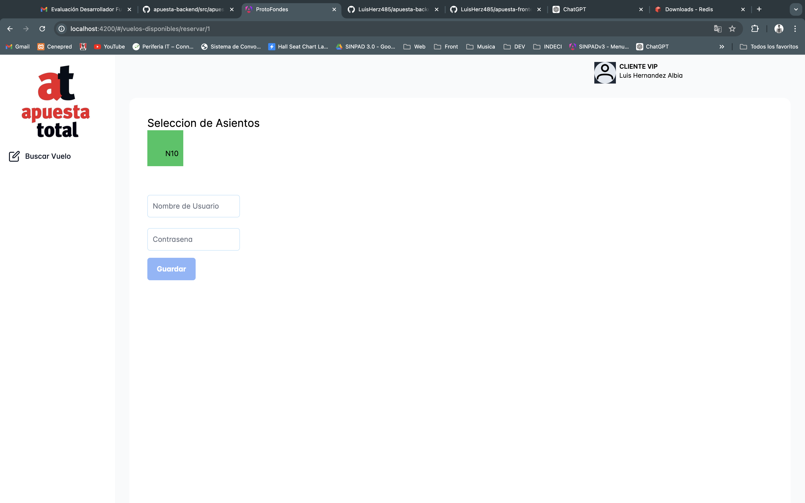

# FrontEnd Prueba Tecnica Apuesta Total

Proyecto realizado en [Angular CLI](https://github.com/angular/angular-cli) version 18.0.4.

## Descripcion

Prueba tecnica para Apuesta total, realizada con Angular 18 con un proceso de compra de boletos de avion

a. Proyecto desarrollador bajo arquitectura DDD, para mejorar la flexibilidad, adaptabilidad y mantenibilidad de todo el proyecto. Asi mismo, Un mejor entendimiento del dominio y una comunicación clara pueden ayudar a identificar y mitigar riesgos potenciales más temprano en el proceso de desarrollo.

## Buenas Practicas

a. Lazy Load Compoentns: Optimizo el rendimiento de tu aplicación minimizando el tamaño de los paquetes, utilizando técnicas de lazy loading y optimizando las imágenes.

b. Linting de codigo : Uso ESLint y Prettier en un proyecto Angular para asegurarte de que todo el equipo siga las mismas reglas de codificación.

c. Seguridad: En un proyecto Angular, usa HttpClient con seguridad, configurando correctamente los headers y protegiendo las rutas sensibles con guardias de autenticación, aun que se puede mejorar colocando un interceptor para realizar la insecion de headers ahi mismo

## Principios SOLID

a. Abierto / Cerrado :Utilizo la herencia o la composición de componentes para añadir nuevas funcionalidades sin modificar los componentes existentes. Por ejemplo, en Angular, podrías extender un componente base para crear variantes más específicas.

b. Principio de responsabilidad Unica : Un componente de Angular debería estar enfocado en una única función, como mostrar una lista de usuarios o un formulario de contacto, en lugar de intentar manejar múltiples funcionalidades.

c. Entre otros.

## Instalacion

Se necesita realizar la instalacion de los plugins necesarios para la inicializacion del proyecto:

```bash
$ npm install
```

## Inicializar el proyecto

Para poder inicializar la aplicacion se debe ejecutar en el terminal `ng serve` para poder inicializar en `http://localhost:4200/`

## Pruebas

1. Implementacion de backend con FrontEnd
   

2. Seleccion de asientos
   
